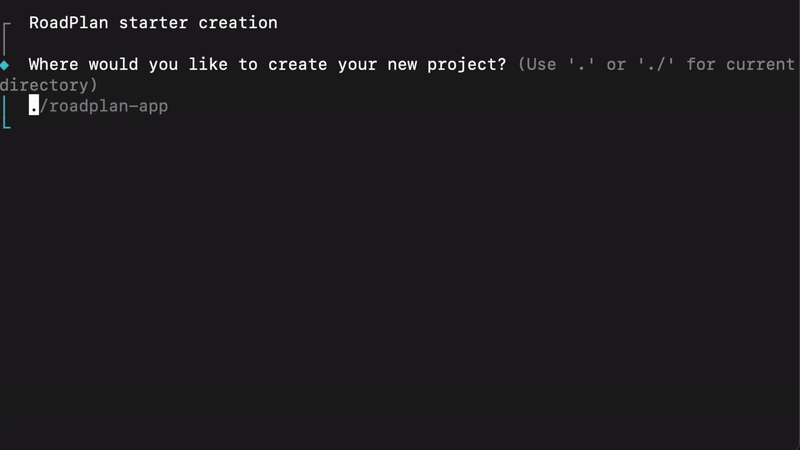

<p align="center">
<br/>
  
  <br/>
  <br/>
</p>

<h1 align='center'>Road Plan</h1>

<div align='center'>
  <h3>Interactive CLI for create documentation starter powered by <a href='https://github.com/BuilderIO/qwik'>Qwik</a></h3>
</div>

### RoadPlan CLI

```shell
pnpm create @qwikdev/roadplan
yarn create @qwikdev/roadplan
npm create @qwikdev/roadplan
bun create @qwikdev/roadplan
```

<div align='center'>
  
</div>
